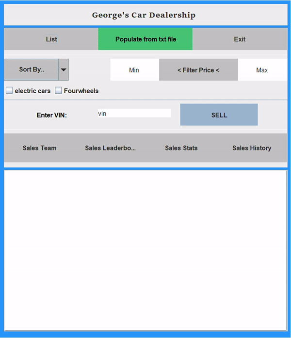
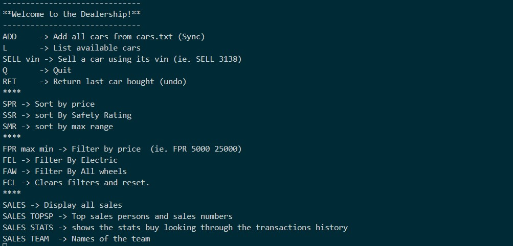

# DealershipGUI
Car Dealership Simulator
DealershipGUI.jar is a Graphical user interface (GUI)  
Right click -> Open with -> Java Platform SE Binary

DealershipCMD.jar is a Command-line interface.
1) Open command prompt inside the folder.
2) Enter "java -jar .\DealershipCMD.jar" and press enter.

ToDo:  
#Add function SAVE to write changes to cars.txt file.  
part 1 - switched to csv and added readcsv function 
#Prevent Clear filters function from reseting inventory.  

